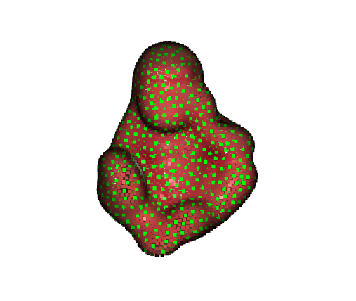
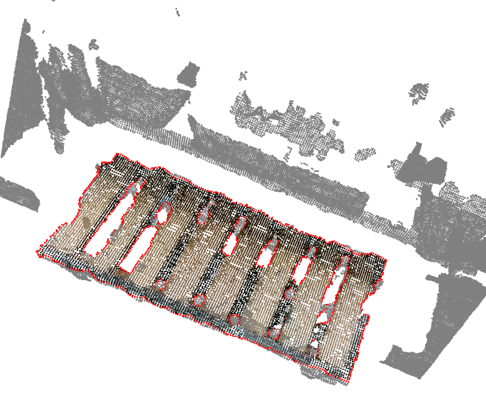
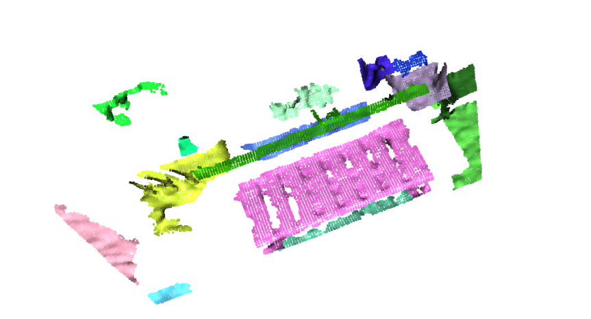
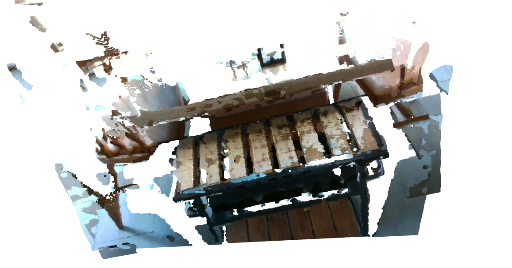
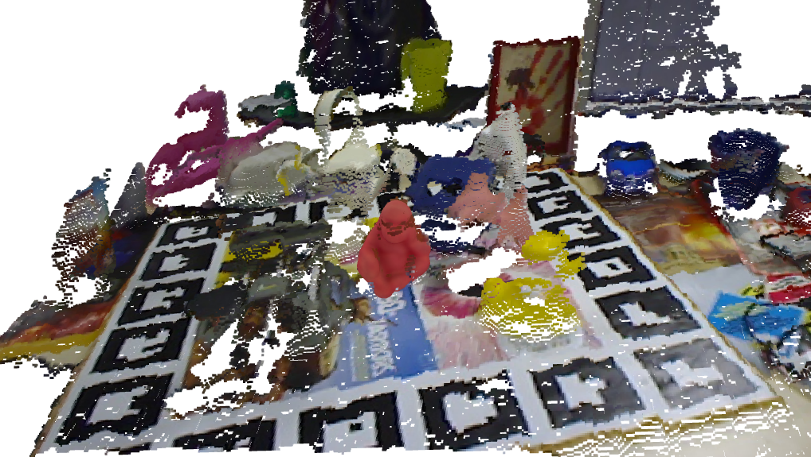

# Misc3D

[](https://github.com/yuecideng/Misc3D/actions/workflows/ubuntu.yml)


A unified library for 3D data processing and analysis with both C++&amp;Python API based on [Open3D](https://github.com/isl-org/Open3D).

This library aims at providing some useful 3d processing algorithms which Open3D is not yet provided or not easy to use, and sharing the same data structures used in Open3D.

Core modules:
- `common`: 
    1. Normals estimaiton from PointMap 
    2. Ransac for primitives fitting, including plane, sphere and cylinder, with parallel computing supported.
    3. K nearest neighbors search based on [annoy](https://github.com/spotify/annoy). It has the similar API as `open3d.geometry.KDTreeFlann` class (the radius search is not supported).
- `preprocessing`: 
    1. Farthest point sampling
    2. Crop ROI of point clouds.
    3. Project point clouds into a plane. 
- `features`:
    1. Boundary points detection from point clouds.
- `registration`:
    1. Corresponding matching with descriptors.
    2. 3D rigid transformation solver including SVD, RANSAC and [TEASERPP](https://github.com/MIT-SPARK/TEASER-plusplus).
- `pose_estimation`: 
    1. Point Pair Features (PPF) based 6D pose estimator. (This implementation is evaluated on Linemod, Linemod-Occluded and YCB-Video dataset, the performance can be found in [BOP Leaderboards/PPF-3D-ICP](https://bop.felk.cvut.cz/leaderboards/))
    2. A RayCastRenderer, which is useful for partial view point clouds, depth map and instance map generation.
    
- `segmentation`: 
    1. Proximity extraction in scalable implementation with different vriants, including distance, and normal angle.
    2. Plane segementation using iterative ransac plane fitting.  
- `vis`: Helper tools for drawing 6D pose, painted point cloud, triangle mesh and etc.

## How to build 
### Requirements
- `cmake` >= 3.10
- `python` >= 3.6
- `eigen` >= 3.3
- `open3d` >= 0.14.1 
- `pybind11` >= 2.6.2

### Build
1. Build `open3d` as external library. You can follow the instruction from here [guide](https://github.com/intel-isl/open3d-cmake-find-package). 
Build `pybind11` in your system as well. If you only use C++ API, you can skip this step and just download the pre-built `open3d` library from [official website](http://www.open3d.org/docs/release/getting_started.html).
##### Linux 
2. Git clone the repo and run:
    ```bash
    mkdir build && cd build
    cmake .. -DCMAKE_INSTALL_PREFIX=</path/to/installation>
    make install -j
    ```
    If you only use C++ API, make sure you add `-DBUILD_PYTHON=OFF`.

3. After installation, add these two lines to `~/.bashrc` file:
    ```bash
    # this is not necessary if you do not build python binding
    export PYTHONPATH="$PYTHONPATH:</path/to/installation>/misc3d/lib/python"
    # this is necessary for c++ to find the customized installation library
    export LD_LIBRARY_PATH="$LD_LIBRARY_PATH:</path/to/installation>/misc3d/lib"
    ```
    Run `source ~/.bashrc` to save changes.
##### Windows
2. Git clone and run: `mkdir build && cd build`. You can use Cmake GUI to configure your build options. Then run `cmake --build . --config Release --target INSTALL` to install `Misc3D`.

3. After installation, add this variable: `/path/to/installation/misc3d/lib/python` to your system environment variable `Path` to make sure you can import `misc3d` in python. 

## How to use
### Python
The example python scripts can be found in `examples/python`. You can run it after you install the library successfully.

You can import `misc3d` same as `open3d`:
```python
import open3d as o3d
import misc3d as m3d
```

```python
# Estimate normals inplace.
m3d.common.estimate_normals(pcd, (640, 480), 3)
```

```python
# Ransac for primitives fitting.
w, indices = m3d.common.fit_plane(pcd, 0.01, 100)
w, indices = m3d.common.fit_sphere(pcd, 0.01, 100)
w, indices = m3d.common.fit_cylinder(pcd, 0.01, 100)
```

```python
# Farthest point sampling.
indices = m3d.preprocessing.farthest_point_sampling(pcd, 1000)
```

```python
# Crop ROI point clouds.
pcd_roi = m3d.preprocessing.crop_roi_pointcloud(pcd, (500, 300, 600, 400), (640, 480))
```

```python
# Project point clouds into a plane.
pcd_plane = m3d.preprocessing.project_into_plane(pcd)
```

```python
# Boundary points detection.
index = m3d.features.detect_boundary_points(
    pcd, o3d.geometry.KDTreeSearchParamHybrid(0.02, 30))
boundary = pcd.select_by_index(index)
```

```python
# Features matching using FLANN or ANNOY
# `fpfh_src` is open3d.pipeline.registration.Feature instance which is computed using FPFH 3d descriptor.
index1, index2 = m3d.registration.match_correspondence(fpfh_src, fpfh_dst, m3d.registration.MatchMethod.FLANN)
index1, index2 = m3d.registration.match_correspondence(fpfh_src, fpfh_dst, m3d.registration.MatchMethod.ANNOY)
```

```python
# Solve 3d rigid transformation.
# Ransac solver
pose = m3d.registration.compute_transformation_ransac(pc_src, pc_dst, (index1, index2), 0.03, 100000)
# SVD solver
pose = m3d.registration.compute_transformation_svd(pc_src, pc_dst)
# Teaser solver
pose = m3d.registration.compute_transformation_teaser(pc_src, pc_dst, 0.01)
```

```python
# PPF pose estimator.
# Init config for ppf pose estimator.
config = m3d.pose_estimation.PPFEstimatorConfig()
config.training_param.rel_sample_dist = 0.04
config.score_thresh = 0.1
config.refine_param.method = m3d.pose_estimation.PPFEstimatorConfig.PointToPlane
ppf = m3d.pose_estimation.PPFEstimator(config)
ret = ppf.train(model)
ret, results = ppf.estimate(scene)
```

```python
# Create a ray cast renderer.
intrinsic = o3d.camera.PinholeCameraIntrinsic(
    640, 480, 572.4114, 573.5704, 325.2611, 242.0489)
renderer = m3d.pose_estimation.RayCastRenderer(intrinsic)

# Cast rays for single mesh with a associated pose.
ret = renderer.cast_rays([mesh], [pose])
depth = renderer.get_depth_map()
# Convert depth map into numpy array. 
depth = depth.numpy()
# Get partial view point clouds of the mesh in the scene.
pcd = renderer.get_point_cloud()
```

```python
# proximity extraction
pe = m3d.segmentation.ProximityExtractor(100)
ev = m3d.segmentation.DistanceProximityEvaluator(0.02)
index_list = pe.segment(pc, 0.02, ev)
```

```python
# plane segmentation using iterative ransac
results = m3d.segmentation.segment_plane_iterative(pcd, 0.01, 100, 0.1)
```

```python
# vis
# draw a pose represented as a axis
m3d.vis.draw_pose(vis, size=0.1)
# draw point clouds painted with red
m3d.vis.draw_geometry3d(vis, pcd, color=(1, 0, 0), size=3.0)
m3d.vis.draw_geometry3d(vis, mesh, color=(1, 0, 0))
m3d.vis.draw_geometry3d(vis, bbox, color=(1, 0, 0))
```

```python
# logging
# the logging api is similar to open3d
# the VerbosityLevel is Info, Error, Debug and Warning
m3d.set_verbosity_level(m3d.VerbosityLevel.Error)
```

### C++
You can run c++ examples after finish build the library, which are inside `/path/to/install/misc3d/bin`. The source code of examples are in `examples/cpp`.
Some results are as follow:
<p float="left">
  
  
  
  
   
</p>

## How to contribute
Misc3D is very open minded and welcomes any contribution. If you have any question or idea, please feel free to create issue or pull request to make Misc3D better.
Please see this [WIKI](https://github.com/yuecideng/Misc3D/wiki/How-to-contribute) for contribution method.


