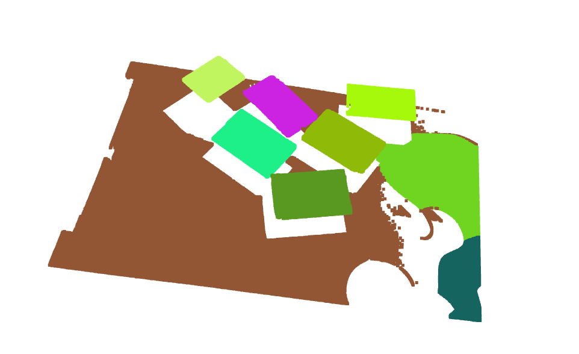
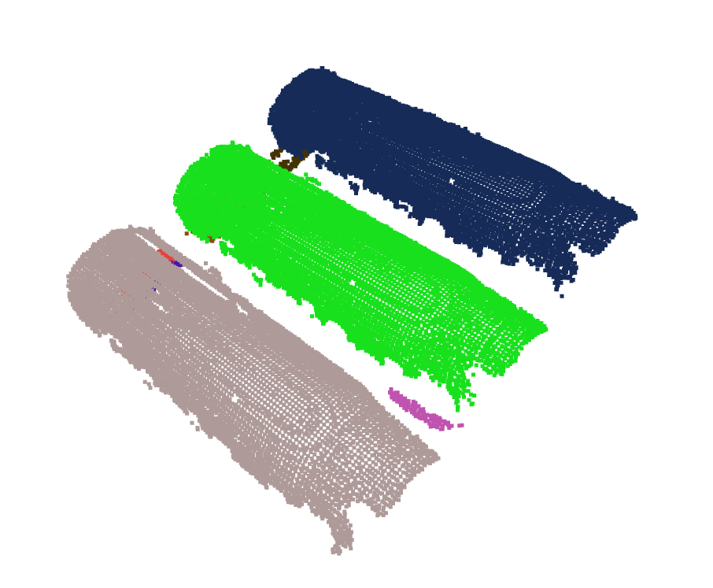

# PrimitivesFittingLib
An unified library for fitting multiple primitives from 3D point cloud data using segmentation and RANSAC algorithm with both C++&amp;Python API.

The supported primitives type:
- Plane
- Sphere
- Cylinder

<p float="left">
  
   
  
</p>

## How to build
### Requirements
- `Cmake` >= 3.13
- `Python` >= 3.6
- `Open3D` >= 12.0 
- `pybind11`
- `Eigen`

### Build
##### Linux (currently only supported)
1. Build `open3d` as external library. You can follow the instruction from here [guide](https://github.com/intel-isl/open3d-cmake-find-package)

2. Git clone the repo and run:
    ```
    mkdir build && cd build
    cmake .. -DOpen3D_DIR=</path/to/open3d> -DCMAKE_INSTALL_PREFIX=</path/to/installation>
    make install -j
    ```
    If you don't want to build python binding, just add `-DBUILD_PYTHON=OFF`.

3. Add python link path:
    Add these two lines to `~/.bashrc` script
    ```
    export PYTHONPATH="$PYTHONPATH:</path/to/installation>/PrimitivesFittingLib/lib/python"
    export LD_LIBRARY_PATH="$LD_LIBRARY_PATH:</path/to/installation>/PrimitivesFittingLib/lib"
    ```
### How to use
The example python scripts can be found in `examples/python`. You can run it after you install the library successfully.

###
