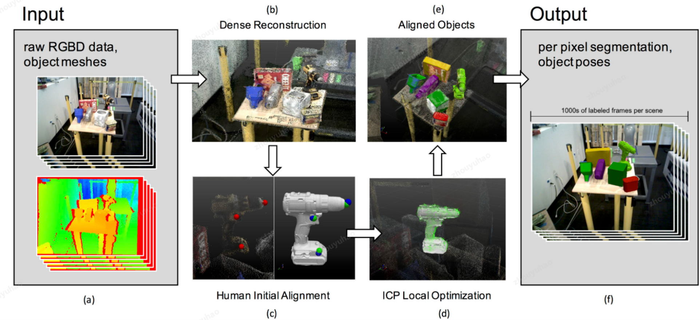
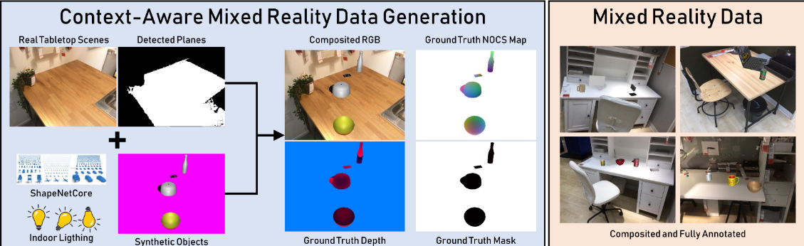
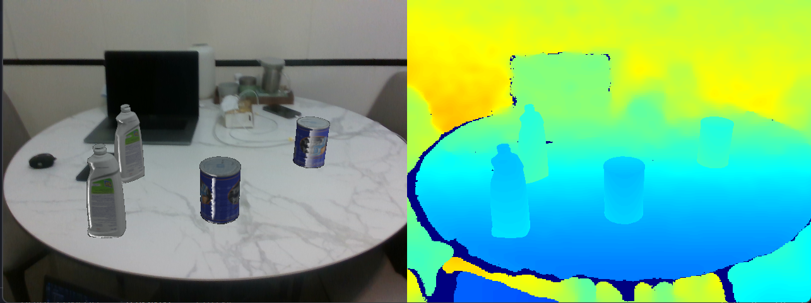

# Instance-level 6D Pose Label Anotation Tool
This is a simple offline label making tools for **instance-level** 6D pose estimation ground truth data generation, which supports two kinds of data generation pipelines: 1. real and 2. mixed-reality. 

**Real Data Pipeline**
- Collect RGBD data from sensor.
- Run RGBD dense reconstruction.
- Pose initialization.
- Rendering mask and generate labels.

The idea is same as the pipeline mentioned in the LabelFusion:
<p float="left">
  
</p>

**Mixed-Reality Data Pipeline**
- Collect RGBD data (background only) from sensor.
- Placement Generation.
- Rendering color and depth labels. 

The idea is same as the pipeline mentioned in the NOCS:
<p float="left">
  
</p>

## Requirements
- `opencv-python`
- `open3d`
- `misc3d` (with `reconstruction` module enabled)

## Real Data Pipeline
### Step 1: Collect RGBD data
We provide a simple script (`label_maker/record_data.py`) to collect RGBD data from RealSense RGBD camera. There are some arguments you can set in the script to control record mode and frame rate.

You can also collect the data by yourself. But it is recommended to use the following structure:
```
dataset/
    - color/
        - 000000.png
        - 000001.png
        - ...
    - depth/
        - 000000.png
        - 000001.png
        - ...
```

**Note:**
You should collect no more than 300 pairs of RGBD data for each dataset, otherwise the scene resonstruction in next step will be very slow. You can record your data by multiple times with different scene (different models, backgraound, etc.)

### Step 2: Run RGBD dense reconstruction
Run `python3 real/reconstruction.py config.json` to get the reconstructed scene. You must change the `camera` parameters in the `config.json` file to match your camera specification.

You can use `real/draw_geometry.py` to visualize the reconstructed scene triangle mesh or point clouds.

### Step 3: Pose initialization
1. Prepare your model file with the following structure:
    ```
    model/
        - 0.ply
        - 1.ply
        - 2.ply
        - ...
    ```
    **You must use number as the model name to indicate the mask value of each frame.**
2. Run `python3 real/init_obj_pose.py --model_path <your/model/path> --data_path <your/data/path>`, and follow the instruction printed in the terminal.

    After finish the process, you will find the `init_poses.json` in your data path.

### Step 4: Rendering mask and generate labels
Run `python3 real/generate_labels.py --model_path <your/model/path> --data_path <your/data/path>`. (add `--vis` to visualize the rendering instance mask)

The results are 16 bit masks stored in `dataset/mask` and `json` file which contains 6d pose, bbox, object id and instance id. A minimal example with only one frame can be seen below:
```json
{
    "000000": [
        {
            "obj_id": 0,
            "instance_id": 0,
            "cam_R_m2c": [
                [
                    0.9014091842603533,
                    0.43197344750891603,
                    -0.029332970840869017
                ],
                [
                    0.22044418653117434,
                    -0.5162045410566827,
                    -0.8276093477100617
                ],
                [
                    -0.3726470758716603,
                    0.7395483841100113,
                    -0.560537549504563
                ]
            ],
            "cam_t_m2c": [
                0.29020161109027537,
                0.2501192190463131,
                0.6792205163170392
            ],
            "bbox": [
                498,
                398,
                142,
                82
            ]
        },
        {
            "obj_id": 0,
            "instance_id": 1,
            "cam_R_m2c": [
                [
                    0.816165164729526,
                    0.5773665735205735,
                    -0.022853088700338718
                ],
                [
                    0.30813881463069986,
                    -0.4683609651098311,
                    -0.828063087741133
                ],
                [
                    -0.4887994423073907,
                    0.6687943227499061,
                    -0.5601689558137602
                ]
            ],
            "cam_t_m2c": [
                0.12174972304257478,
                0.18991541206314635,
                0.7773315438193125
            ],
            "bbox": [
                350,
                337,
                144,
                133
            ]
        }
    ]
}
``` 

The value for each instance object in the mask is equal to `v = obj_id * 1000 + instance_id`. You can decode each instance into a 8 bit mask image with single object contained using the following code:
```python
# you already have mask, obj_id and instance_id
mask_new = np.zeros((mask.shape[0], mask.shape[1]), dtype=np.uint8)
v = obj_id * 1000 + instance_id
mask_new[mask == v] = 255
``` 

### Reference:
LabelFusion 
- [paper](https://ieeexplore.ieee.org/abstract/document/8460950)
- [code](https://github.com/RobotLocomotion/LabelFusion)

## Mixed-Reality Data Pipeline
### Step 1: Collect RGBD data
Same as the real data pipeline, but you only need to collect the scene data with background only (desk or table).

### Step 2: Placement Generation & Rendering color and depth labels
First, prepare your model file with the following structure:
```
model/
    - 0.ply
    - name_of_obj_1_uv_map.png
    - 1.ply
    - name_of_obj_2_uv_map.png
    - 2.ply
    - name_of_obj_3_uv_map.png
    - ...
```
**Note: You should not change your uv map file name since the ply usually stores the file name of it**

Run `python3 mixed/generate_placement.py --model_path <your/model/path> --data_path <your/data/path>`. (add `--vis` to visualize the rendering color and depth image). You can also check the source file `mixed/generate_placement.py` to see more arguments you can set.

After generation, the data format is the same as the real data pipeline.

The generation results can be seen as the following example:
<p float="left">
  
</p>

### Reference:
NOCS
- [paper](https://arxiv.org/abs/1901.02970)


